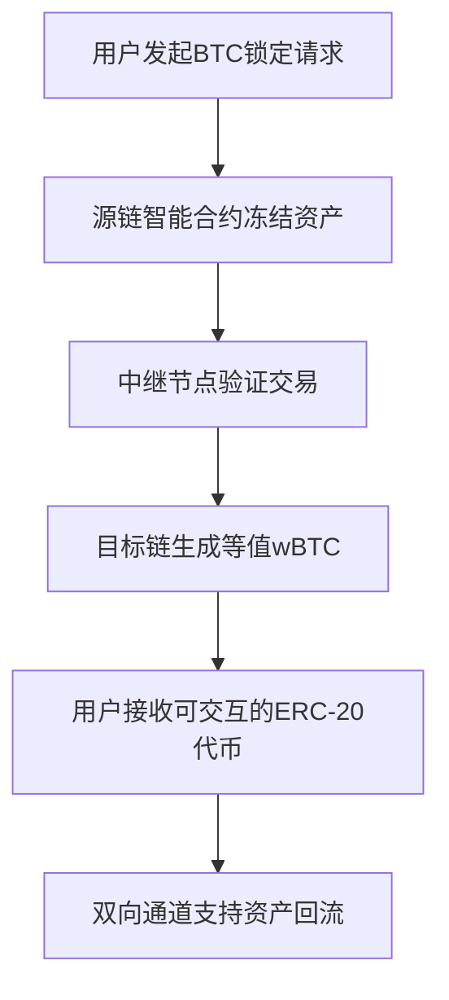

# 什么是加密货币桥接？（加密货币桥如何运作？）

在区块链技术快速发展的今天，加密货币桥接（Crypto Bridging）正成为连接不同区块链网络的关键技术。它不仅解决了区块链之间的数据孤岛问题，还为去中心化金融（DeFi）生态系统提供了更广阔的扩展空间。本文将深入解析加密货币桥接的运作机制、类型分类、风险评估及实际应用场景。

---

## 区块链互操作性：加密桥接的核心价值

区块链技术的三大核心优势——安全性、透明性和高效性——在多链环境下面临重大挑战。由于不同区块链网络采用异构架构和共识机制，资产和数据的跨链流通长期受限。加密货币桥接技术的出现，成功构建了连接以太坊、比特币、Solana等公链的数字高速公路。

👉 [了解主流区块链网络的生态差异](https://bit.ly/okx_welcome)

### 核心功能解析
- **资产跨链转移**：实现BTC、ETH等原生资产在不同链上的价值映射
- **数据互通**：支持智能合约调用、跨链预言机等复杂交互
- **生态融合**：促进DeFi、NFT、Web3.0等应用场景的跨链集成

---

## 加密桥接的运作机制详解

以将比特币转移至以太坊网络为例，完整流程包含六个关键步骤：

### 技术实现对比
| 机制类型         | 安全性评级 | 跨链速度 | 典型案例       |
|------------------|------------|----------|----------------|
| 哈希时间锁(HTLC) | 高         | 10-30分钟| Lightning Network |
| 侧链中继桥       | 中         | 3-5分钟  | Polygon Bridge  |
| 联邦共识桥       | 中低       | 实时     | Ronin Bridge    |

---

## 七大主流桥接类型全解析

### 1. 跨链桥（Cross-chain Bridge）
- **技术特征**：采用中继链架构实现异构链通信
- **代表项目**：Chainlink CCIP、Wormhole
- **适用场景**：BTC与ETH生态间的价值流动

### 2. 侧链桥（Sidechain Bridge）
- **核心优势**：提升主网扩展性同时保持安全性
- **典型案例**：Polygon PoS桥接至以太坊
- **性能数据**：TPS提升10-50倍，Gas费降低90%

### 3. 可编程桥（Programmable Bridge）
- **创新特性**：支持跨链合约调用与数据传输
- **技术突破**：LayerZero实现的ZetaChain跨链结算
- **应用前景**：跨链DeFi聚合器、多链NFT市场

👉 [探索可编程桥接的DeFi应用场景](https://bit.ly/okx_welcome)

---

## 风险管理与安全考量

### 2022-2023年重大安全事故统计
| 时间       | 桥接项目   | 损失金额 | 攻击类型         |
|------------|------------|----------|------------------|
| 2022.02    | Wormhole   | $3.26亿  | 签名验证漏洞     |
| 2022.08    | Horizon    | $1.89亿  | 跨链签名伪造     |
| 2023.04    | Ronin      | $6.15亿  | 私钥泄露         |

### 安全评估维度
1. **共识机制**：PoS桥接需警惕51%攻击风险
2. **验证节点**：分布式程度与节点信誉评估
3. **智能合约**：第三方审计报告与漏洞修复记录
4. **保险覆盖**：项目方是否接入链上保险协议

---

## 桥接 vs 包裹资产：深度对比

| 维度         | 加密桥接               | 资产包裹               |
|--------------|------------------------|------------------------|
| 资产控制权   | 完全转移               | 原资产锁定+衍生代币    |
| 流动性效率   | 跨链即时到账           | 需依赖中间交易市场     |
| 安全模型     | 依赖桥接协议安全性     | 依赖托管方信用         |
| 典型应用     | 跨链DEX、多链Staking   | WBTC、ETHx等衍生品     |

---

## 如何选择最佳桥接方案？

### 决策矩阵分析
1. **使用场景**：单次大额转账 vs 频繁小额交互
2. **安全需求**：机构级托管 vs 个人钱包管理
3. **生态兼容**：EVM兼容链 vs 非EVM异构链
4. **成本考量**：Gas费+桥接手续费综合计算

### 主流平台对比测评
| 桥接平台      | 支持链数 | 平均手续费 | 审计机构       | TVL排名 |
|---------------|----------|------------|----------------|---------|
| Orbiter Finance | 15+      | $3-8       | Certik         | 1       |
| LayerZero     | 20+      | $5-15      | ChainSecurity  | 2       |
| Axelar        | 12       | $10-20     | SlowMist       | 3       |

---

## 未来发展趋势预测

1. **零知识证明应用**：ZK-Rollups技术降低跨链验证复杂度
2. **模块化架构**：Celestia等DA层提供专用桥接解决方案
3. **监管合规化**：新加坡MAS、欧盟MiCA框架规范跨链交易
4. **跨链标准协议**：CCF（跨链通信框架）成为行业规范

👉 [把握下一代跨链技术投资机遇](https://bit.ly/okx_welcome)

---

## 常见问题解答（FAQ）

**Q1：跨链桥接是否需要双重支付Gas费？**  
A：是的，需要分别支付源链和目标链的Gas费用，但Layer2桥接方案可显著降低综合成本。

**Q2：如何验证桥接资产的真实性？**  
A：通过区块链浏览器核查智能合约地址，确认是否具有第三方审计认证。

**Q3：桥接过程出现延迟如何处理？**  
A：优先检查网络拥堵状况，若超时未到账，立即联系项目方客服并提供交易哈希。

**Q4：小额转账是否适合使用跨链桥？**  
A：建议单笔金额超过$1000时使用桥接，小额转账更推荐使用中心化交易所的链上转换功能。

**Q5：桥接资产是否会影响质押收益？**  
A：部分桥接协议支持跨链质押，如Stakely实现的多链Staking服务，年化收益可达8-15%。