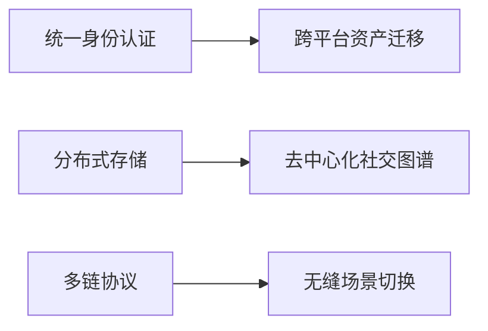

# 元宇宙霸主？加密货币如何打破科技巨头的虚拟垄断

## 元宇宙的前世今生

元宇宙概念最早可追溯至1992年尼尔·斯蒂芬森在《雪崩》中描绘的虚拟世界。这个浸入式数字空间允许用户通过个性化化身突破物理限制，在数字经济中创造、交易和社交。威廉·吉布森在1984年《神经漫游者》中提出的赛博空间概念，以及《头号玩家》的绿洲平台，共同构建了元宇宙的早期雏形。

**核心特征解析：**
- 持续性：7×24小时不间断运行
- 经济系统：数字资产确权与交易体系
- 互操作性：跨平台身份与资产迁移能力
- 用户创造：UGC内容生态构建

> "元宇宙不是游戏或硬件，而是由协议、技术、内容组成的数字生态系统" - Matthew Ball

## 虚拟经济的范式转移

### 传统平台的局限性
主流虚拟世界如Fortnite、Roblox等虽具雏形，但存在显著缺陷：
| 平台        | 用户规模        | 资产流动性 | 跨平台能力 |
|-------------|-----------------|------------|------------|
| Fortnite    | 3.5亿月活       | 有限       | 无         |
| Roblox      | 6600万日活      | 封闭经济   | 无         |
| SecondLife  | 100万月活       | 部分流通   | 无         |

### 区块链技术的突破性贡献
基于区块链的元宇宙平台通过以下创新重构虚拟经济：
1. **数字产权确权**：NFT技术实现虚拟资产的唯一性认证
2. **去中心化治理**：DAO模式让用户参与平台决策
3. **跨链互操作性**：Polygon等协议打破生态壁垒
4. **通证经济激励**：AXS、MANA等代币驱动生态发展

**典型平台经济数据：**
- Decentraland：虚拟土地总值超10亿美元
- The Sandbox：用户创作内容年交易额达3.2亿美元
- Axie Infinity：日均活跃用户超200万

👉 [探索区块链赋能的元宇宙经济体系](https://bit.ly/okx_welcome)

## 互操作性的生死博弈

科技巨头构建的"围墙花园"模式正面临挑战：
- **封闭生态困局**：索尼2018年曾抵制《堡垒之夜》跨平台互通
- **用户觉醒浪潮**：VR用户中63%期待跨平台资产迁移
- **技术标准争夺**：Epic Games推动开放协议 vs 苹果生态封闭战略

开放标准的支持者提出解决方案：


> "未来十年，玩家应能在《我的世界》《Roblox》《堡垒之夜》间自由穿梭" - Tim Sweeney

## 加密货币的战略价值

### 支付系统的革命性突破
传统支付方式在虚拟经济中的局限：
- 跨境支付手续费高达5-7%
- 法币兑换存在3-5个工作日延迟
- 平台抽成比例普遍超过30%

加密支付解决方案优势：
| 指标        | 传统支付 | 加密支付 |
|-------------|----------|----------|
| 交易速度    | 3-5天    | 15秒     |
| 手续费率    | 2.9%+    | 0.1%     |
| 全球覆盖    | 195国    | 230国    |
| 透明度      | 黑箱操作 | 链上可查 |

### 虚拟地产的金融化创新
Decentraland土地交易演变：
```
2017年：首块土地成交价1000美元
2021年：地块均价突破2万美元
2023年：商业综合体交易达480万美元
```

**创新金融模式：**
- 土地NFT抵押借贷
- 虚拟地产REITs
- 租赁收益权证券化

👉 [参与元宇宙资产投资新机遇](https://bit.ly/okx_welcome)

## 社会价值与争议并存

### 创造经济新范式
- 菲律宾Axie玩家月均收入达当地最低工资3倍
- Decentraland赌场提供远程就业岗位
- 数字艺术家收入提升400%（OpenSea数据）

### 面临的现实挑战
- 以太坊Gas费波动影响小微交易
- 土地投机导致78%新用户无法入驻核心区域
- DAO治理暴露决策效率缺陷

> "当系统设计导致用户被排除在外时，我们该反思技术伦理" - Jesse Alton

## 未来演进路径预测

### 技术融合趋势
- Web3.0与AI结合：智能NPC创造动态经济系统
- VR/AR突破：Meta Quest Pro实现眼动追踪交互
- 边缘计算：降低元宇宙接入设备性能门槛

### 生态格局演变
| 阶段       | 主导力量       | 用户特征       | 核心矛盾       |
|------------|----------------|----------------|----------------|
| 2023-2025  | 科技巨头       | 圈层化体验     | 数据垄断       |
| 2025-2027  | 区块链创新者   | 资产确权需求   | 标准之争       |
| 2027-2030  | 混合生态       | 跨域协作       | 治理模式       |

### 投资者关注焦点
1. 跨链协议项目（如Polkadot平行链）
2. 元宇宙开发者工具（3D建模SDK）
3. 身份验证Layer2解决方案
4. 虚拟现实内容创作基金

👉 [把握元宇宙投资黄金窗口](https://bit.ly/okx_welcome)

---

### 常见问题解答

**Q：普通用户如何参与元宇宙经济？**  
A：可通过创建数字内容、参与DeFi质押、投资虚拟地产等多种方式，最低100美元即可入门。

**Q：区块链技术如何保障数字资产安全？**  
A：基于哈希加密和分布式账本技术，用户通过私钥掌控资产，智能合约自动执行交易规则。

**Q：元宇宙是否会导致现实社会隔离？**  
A：关键在平衡发展，新加坡已将元宇宙纳入智慧国建设计划，用于远程医疗、虚拟政务等公共服务。

**Q：加密货币波动性是否影响元宇宙发展？**  
A：代币经济设计正趋成熟，如The Sandbox引入双币体系（ SAND + USD锚定币）稳定生态。

**Q：如何避免元宇宙沦为投机泡沫？**  
A：需建立动态NFT价值评估模型，参考Decentraland引入现实数据锚点（如天气变化影响虚拟商业）。

**Q：中国政府对元宇宙发展持何态度？**  
A：2023年《元宇宙发展三年行动计划》明确支持数字孪生、虚拟现实技术创新，重点发展实体经济融合应用。