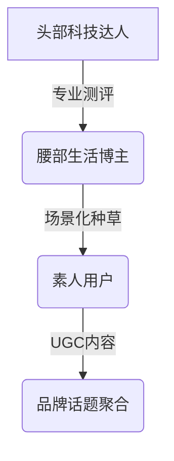

# 深圳小风扇在东南亚，借TikTok Shop一年“吹”出上亿营收

## 中国智造的东南亚突围战

在深圳龙岗区的某科技园区内，几素科技的研发团队正调试着新一代手持风扇的风道系统。这支重量仅160克的"清凉神器"，正以单月破百万件的销量席卷东南亚市场。2024年财报显示，该品牌海外营收突破10亿元，其中70%来自东南亚市场。这场以TikTok Shop为跳板的出海战役，不仅改写了小家电行业的出海逻辑，更揭示了中国品牌全球化的新路径。

👉 [如何利用短视频平台实现品牌破圈](https://bit.ly/okx_welcome)

## 热带经济催生千亿蓝海

### 气候与消费习惯的双重红利
东南亚六国6.5亿人口中，85%居住在热带气候区，年均高温天数超过200天。便携风扇作为刚需消费品，市场渗透率却不足40%。深圳电子商会调研显示：
| 国家       | 人均年消费电扇(美元) | 市场增速(2024) |
|------------|---------------------|---------------|
| 菲律宾     | 8.2                 | 37%           |
| 越南       | 6.5                 | 42%           |
| 泰国       | 7.8                 | 29%           |

### 电商平台的指数级增长
TikTok Shop 2025白皮书数据显示，东南亚小家电品类年复合增长率达68%，其中手持风扇细分市场2024年规模突破25亿美元。平台用户调研揭示：
- 73%消费者首选直播间购买
- 48%用户愿为长续航多付50%溢价
- 61%用户关注产品创新设计

## 品牌出海的三大破局点

### 技术创新构建护城河
几素科技在核心部件上的持续投入：
- 自研高速节能电机：能耗降低40%，风量提升30%
- 磁吸模块化设计：支持12种形态转换
- 9000mAh电池组：实现24小时续航
这些技术突破使其产品定价达到市场均价3倍，却仍保持45%复购率。

### 达人矩阵的精准渗透
品牌构建三级达人生态：

与2300名达人的合作产生3400条带货视频，其中：
- 头部达人贡献35%GMV
- 腰部达人创造50%互动
- 素人视频带来28%转化

### 文化共鸣的营销策略
在菲律宾圣诞季推广中，品牌推出"清凉守护计划"：
1. 与本地网红拍摄《风扇里的温暖故事》系列短片
2. 联合公益组织向贫民区捐赠5000台风扇
3. 发起#MyJisuStory话题挑战赛
活动期间单店粉丝增长12万，客单价提升22%。

👉 [达人带货策略解析](https://bit.ly/okx_welcome)

## FAQ：品牌出海的核心问题

### Q：东南亚电商渗透率仅11%，企业该如何布局？
A：重点关注越南、印尼等人口超亿的新兴市场，优先布局TikTok Shop、Shopee等本土化平台。建议采用"直播+仓储"模式，越南可实现3日达覆盖率85%。

### Q：如何选择合适的带货达人？
A：建议建立"3+5+2"达人组合：
- 3%头部专家（科技测评）
- 50%腰部KOL（生活场景）
- 20%素人用户（真实体验）

### Q：如何维持高价位策略？
A：通过技术创新和体验升级构建护城河。几素科技的案例表明，当产品续航突破12小时、风量突破5m³/min时，消费者价格敏感度下降60%。

## 数据驱动的增长飞轮

### TikTok生态的乘数效应
品牌在平台运营中形成正向循环：
1. 优质内容获得流量扶持
2. 达人合作提升转化效率
3. 用户好评反哺搜索排名
4. 品牌溢价强化市场认知

平台数据显示：
- 每增加1000条好评，搜索排名提升8位
- 视频完播率提升1%，转化率增长3.2%
- 达人带货ROI可达1:7.5

### 全球化布局的下一步
几素科技正在推进：
- 泰国本地化生产线（2025Q1投产）
- 中东市场适配机型研发（耐高温设计）
- 碳中和包装方案（可降解材料占比70%）

## 中国智造的全球启示

在深圳湾创新走廊，更多企业正在复刻这种"技术+内容"双轮驱动的出海模式。TikTok Shop 2025报告显示，中国小家电品牌在东南亚市场份额已从2021年的18%跃升至43%，其中手持风扇品类TOP10品牌中占据7席。

这种转变背后，是价值创造逻辑的根本变革：
1. 从价格竞争转向体验竞争
2. 从渠道依赖转向用户运营
3. 从产品输出转向技术输出

正如几素联合创始人所言："当我们的风扇出现在苹果专卖店展台时，这不仅是产品的胜利，更是中国智造标准的输出。"这种标准正在重新定义全球小家电市场的游戏规则。